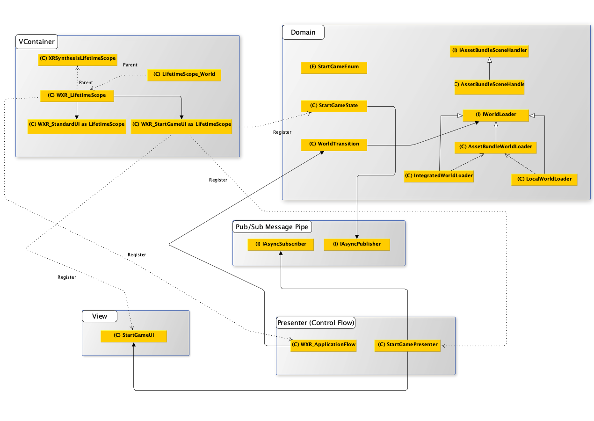

> Author: TriHD
> 
> Last updated: 07-05-2024
# Architecture

1. Description

   
2. Diagram

  
# Example
>Yêu cầu: tạo 1 UI đơn giản có 1 tấm Dim background hiện dòng chữ "Click To Start" và đợi sự kiện click trên UI để tắt nó đi.
>
>Demo: https://drive.google.com/file/d/1GLJ80tvvxMHhwU5gyTFrwwL2t0Ts7w9-/view?usp=sharing

1. VContainer Layer (WXR_LifeTimeScope)
````
- DI container WXR_LifeTimeScope sẽ tạo một child prefab nằm trong một scope mới là LifeTimeScope của WXR_StartGameUI prefab.
- Scope mới này được enqueue vào parent là WXR_LifeTimeScope (nói cách khác thì WXR_LifeTimeScope là parent của Scope mới).
````


2. Domain Layer + Pub/Sub Message (StartGameState)
````
- Sau khi khởi tạo scope mới thành công ở trên, chạy StartGameState để xử lý logic của Domain Layer (chạy startGameState.Run() trong hình ở bước trên).
- StartGameState sẽ dùng pub/sub message để đợi phần xử lý bên Presentation Layer bên dưới đã subscribe.
- Cụ thể StartGameState sẽ đợi phần ShowUI hoàn thành và sau đó đợi phần HideUI (chờ sự kiện click trên UI để kết thúc).
- Kết thúc phần xử lý của StartGameState.
````


3. Presentation Layer + Pub/Sub Message (StartGamePresenter)
````
- Nhiệm vụ chính của layer này là cấu nối giữa Domain Layer và View Layer để tách biệt phần control logic ra khỏi View Layer và Domain Layer.
- StartGamePresenter sẽ subscribe vào pub/sub message để lắng nghe sự kiện publish từ Domain Layer và xử lý logic.
- Method ShowUIAsync đơn giản là sẽ đợi sự kiện click trên UI và kết thúc. 
````


4. View Layer (StartGameUI)
````
- Phần layer này chỉ chứa view script (thường là Monobehaviour) và không chứa bất kì domain hay control logic nào bên trong.
````


  

