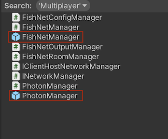
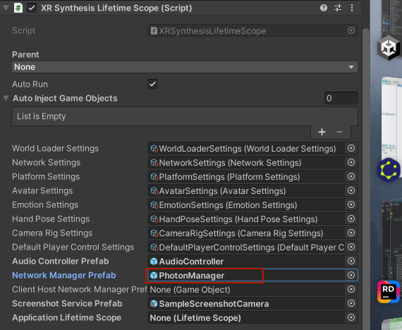

> Author: TriHD
> 
> Last updated: 08-05-2024
> 
> [English/[Vietnamese](../Networking.md)]

# Networking

## Configuration
1. Network Settings
- To modify settings for networks (network id, max player, send rate, player prefab...), find 2 settings as below.
````
- PhotonSettings 
- FishNetSettings
````


2. Network Prefabs
- To change the network between Photon and Fishnet, find the corresponding prefab and replace it with the Network Manager Prefab located in the XRSynthesisLifetimeScope prefab.





## Flow
### Diagram


### Description
1. XRSynthesisLifetimeScope (VContainer)
````
- Register NetworkConnectController as an entry point (run as a monobehaviour)
- This entry point will run continuously throughout the network handler
````

2. NetworkConnectController (Presenter - Control Flow)
````
- Use message pipe to broadcast to NetworkConnectAreaTrigger.
- Keep waiting for the event that the player enters the area where he can connect to the network.
- If the event above is triggered, start connecting and joining the room through the INetworkManager interface (injected with VContainer)
```` 

3. NetworkConnectAreaTrigger (Domain)
````
- Use message pipe to listen for event from NetworkConnectController.
````

4. INetworkManager (PhotonManger/FishNetManager) (Domain)
````
- After the player successfully connects to the room, create an instance of the character entity using the prefab Vi_PhotonPlayer or Vi_FishNetPlayer.
- This entity is used as a bridge to sync data.
- Data is synced back and forth between local player and remote player (both local and remote player are created from prefab WXR_Player Variant which attached in NetworkSettings)
````

5. Domain Photon/Domain Fishnet
-  Contains components attached to Vi_PhotonPlayer or Vi_FishNetPlayer, they are used to sync player data of WXR_Player Variant.
````
[Photon]
- PhotonPlayer.cs
- AvatarAnimationSync.cs
- TrackingModeSync.cs
- HandPoseSync.cs

[Fishnet]
- FishNetPlayer.cs
- FishNetAvatarAnimationSync.cs
- FishNetTrackingModeSync.cs
- FishNetHandPoseSync.cs
````

## Setup

1. Fishnet
- Setup local server:
````
https://docs.google.com/presentation/d/1skq_U9g1ANTi8WUn-5bG0_7vpjN2k1oVnqthiAZ7Who/edit#slide=id.g2c95909dc32_0_48
````

## Important Notes

1. Project Script Define Symbol (Fishnet) [25-4-2024]
````
https://visualive.atlassian.net/wiki/spaces/MET/pages/303038470
````

[VN]
> <FYI>
> Em share lại phần khách nói về nhánh nãy mtg có share sơ sơ mới team mình nha ^^
>
> Cái page dưới này note lại Fishnet connection + symbol setting
> https://visualive.atlassian.net/wiki/spaces/MET/pages/303038470
>
> hiện phần này nó đang dc thiết lập ở symbol『NETWORK_KARAOKE』
> nếu mình có phát triển tính năng gì liên quan tới fishnet or symbol thì sẽ làm trên nhánh đó
>
> nếu sau này, mình có build gì, thì trc khi build, khách có thể sẽ request mình đổi tên symbol thành『NETWORK_KARAOKE_DEMO』
> còn khách khum request thì mình để nguyên nhánh build lun khỏi đổi gì hết cũng ok

[JP]
> 以下のページの下にFishNetの接続先とシンボルの設定表があります。
> https://visualive.atlassian.net/wiki/spaces/MET/pages/303038470
>
> 何もしなければ、カラオケのブランチの時は現在は『NETWORK_KARAOKE』になっていると思います。
> 開発の時はそのまま進めてください。
>
> もし今後、VFAさんでビルドをするときに
> ビルド前に『NETWORK_KARAOKE_DEMO』に変更してくださいとお願いすることがあるかもしれません。
> お願いが無ければ変更せずビルドしてください。
>
> その時はお声がけしますので
> そのような指示があったときには『NETWORK_KARAOKE_DEMO』に変更をよろしくお願いいたします。


