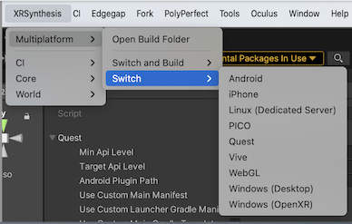
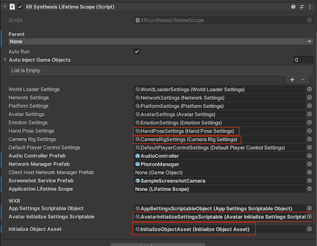
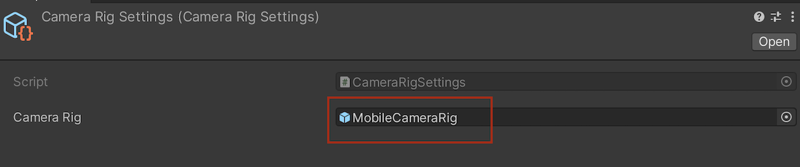
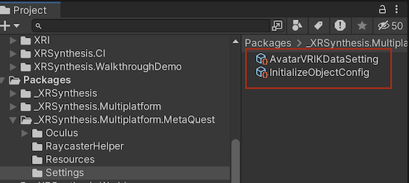
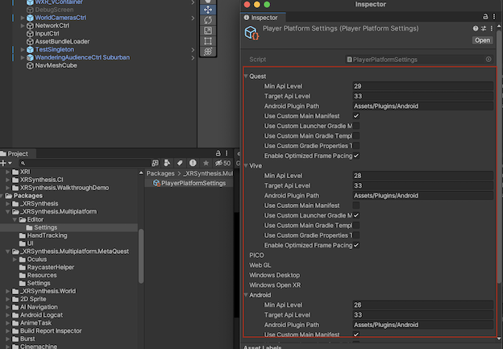
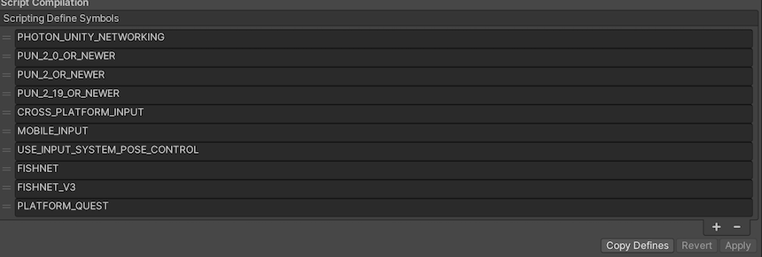
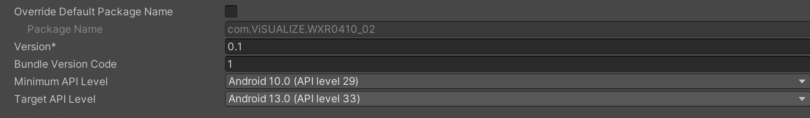

> Author: TriHD
> 
> Last updated: 08-05-2024
> 
[English/[Vietnamese](../PlatformSwitcher.md)]
# Overview

## Switch platform
 
- The XRSynthesis.Multiplatform function is intended to collectively change settings for Unity build targets, packages, camera rigs, XR Plugin Management plugins, player settings, game settings (ex: HandPoseSettings, InitializeObjectAsset,...).
- Be sure to switch the platform from this menu, not from Unity's Build Settings:

  > XRSynthesis/Multiplatform/Switch/<target_platform>



Currently we are working on the following platforms
````
- Quest
- Vive
- Windows (OpenXR) (Meta Quest)
- Mobile (Android/iOS)
````

Further platforms to work on 
````
- Apple Vision Pro
````

## XRSynthesis Settings

1. When switching platforms, there are some changes that will occur in the settings within the XRSynthesis prefab.


2. These settings below will change
````
- HandPoseSettings
- CameraRigSettings
- AvatarInitializeSettingsScriptable
- InitializeObjectAsset
````



3. About AvatarInitializeSettingsScriptable
```` 
- AvatarVRIKDataSetting will be changed.
- AvatarVRIKDataSetting is used to store IK Anchor data for the avatar body (head, hand, chest,...) when using controller or hand tracking.
````


4. About CameraRigSettings
```` 
- Camera rig prefab will be replaced.
- Camera rig prefab will be used to setup VR components (VR camera, VR tracking mode, VR input...) for the current platform.
````    



5. About HandPoseSettings
````
- HandTrackingPose asset will be changed.
- HandTrackingPose asset is to apply initial finger poses for both hands when using hand tracking.
- The Hand Poses section is to apply finger poses for specific actions when using the controller.
````


6. About InitializeObjectAsset
````
- Assgin essential prefabs to handle UI, event system, data manager and so on.
````


## 3.	Platform Packages
When switching to any platform, essential packages will be installed from two sources
````
- Install from LocalPackages
- Install from Unity Package Manager with package name automatically
````

1. Install from LocalPackages
   


- LocalPackages folder content


````
- Each platform will require its own packages
Ex:
[Quest]
    + XRSynthesis.Multiplatform.MetaQuest (from LocalPackages)
    + Oculus XR Plugin (from package manager with package name com.unity.xr.oculus@4.0.0)

[Vive]
    + XRSynthesis.Multiplatform.Vive (from LocalPackages)
    + ViveWaveXR/WaveEssence (from LocalPackages)
    + ViveWaveXR/WaveNative (from LocalPackages)
    + ViveWaveXR/WaveXRSdk (from LocalPackages)
````

## Project Settings
Each platform will perform these changes below and they will be different from others

1. Custom Build


2. Graphic Api


3. Platform Data



4. Player Platform Settings



5. Script Define Symbol



6. Targe/Minimum Api Level


## Implementation
````

````
