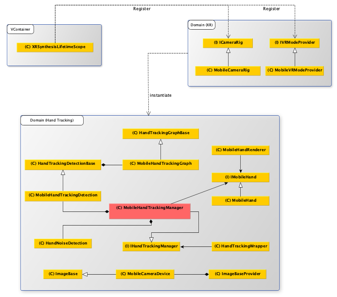

> Author: TriHD
> 
> Last updated: 21-05-2024
> 
> [Vietnamese]
# Hand Tracking For Mobile

## Related Platforms
Platform   |Notes       
----------------|------------
[Quest](./Platforms/HandTracking_Quest.md)|Hand tracking for Quest.
[Vive](./Platforms/HandTracking_Vive.md)|Hand tracking for Vive.

## Flow
### Diagram


### Description
1. XRSynthesisLifetimeScope (VContainer)
````
- Đăng ký ICameraRig, ICameraRig được kế thừa bởi MobileCameraRig.
- Đăng ký IVRModeProvider, IVRModeProvider được kế thừa bởi MobileVRModeProvider.
````

2. Domain (XR)
````
- MobileCameraRig dùng để thiết lập tracking cho VR (head, left/right hand,....) và xử lý input từ VR.
- Tracking VR (head, left/right hand,....) sẽ được xử lý thông qua Domain (Hand Tracking).
- MobileVRModeProvider dùng để kiểm soát những phần xử lý khi chuyển đổi qua lại giữa non-VR mode và VR mode.
```` 

3. Domain (Hand Tracking) 
- <ins>MobileHandTrackingManager</ins>
````
- Đọc dữ liệu handlandmark và handedness từ MobileHandTrackingDetection.
- Khử nhiễu dữ liệu đầu vào bằng HandNoiseDetection.
- Phân chia dữ liệu đã khử cho tay trái và tay phải thông qua IMobileHand.
- Cập nhật xử lý cho tay trái/phải.
````

- <ins>HandNoiseDetection</ins>
````
- Đọc dữ liệu handlandmark và handedness.
- Khử nhiễu bằng cách:
  + Phát hiện sự thay đổi đột ngột của trạng thái tay (active/inactive)
  + Giữ nguyên trong x frame (x sẽ được điều chỉnh tùy theo cảm nhận khi test) trước khi chấp nhận sự thay đổi. 
- Xử lý nhiễu cho cả 2 trường hợp là 1 tay và 2 tay.
````

- <ins>MobileHandTrackingDetection</ins>
````
- Khởi tạo hand tracking graph (MobileHandTrackingGraph). 
- Khởi tạo camera device (MobileCameraDevice).
- Camera device sẽ đọc texture frame từ webcam device.
- Tracking graph sẽ nhận texture frame ở trên và trả về dữ liệu của landmark và handedness.
````

- <ins>MobileHand</ins>
````
- Dùng data 2D của landmark để tính toán vị trí world.
- Ứng dụng vị trí world để tạo ra tay skeleton ảo (handlandmark).
- Tính toán tracking depth để tất cả handlandmark có chiều sâu.
- Tính toán vị trí và góc xoay của handlandmark anchor (wrist) để apply vào avatar's left/right hand anchor.
- Tìm bone poses và bind bone poses.
- Tính toán góc xoay của bone poses (từng đốt ngón tay) dựa trên handlandmark.
- Bind bone poses dùng để tạo ra trạng thái ban đầu cho phần tự build humanoid avatar.
````

- <ins>MobileHandRenderer</ins>
````
- Xử lý hiển thị render cho:
  + Tay skeleton ảo (tay 3D di chuyển theo avatar hand).
  + Tay build từ bone poses (dùng để debug góc xoay của từng đốt ngón tay).
  + Tay build từ bine bone poses (dùng để setup cho phần build humanoid avatar).
````

- <ins>HandTrackingWrapper</ins>
````
- Tạo ra những api cần thiết cho việc truy cập liên quan đến tracking:
  + Lấy trạng thái tay (active/inactive).
  + Lấy bone pose/bind bone pose.
  + Start/Pause/Stop/Resume xử lý hand tracking.
  + Những phần xử lý khác nếu cần thì implement trong phần wrapper này.
- Mục đích là để clean code cho phần Domain (Hand Tracking) và không cần quan tâm nhiều tới phần xử lý bên dưới.
````


