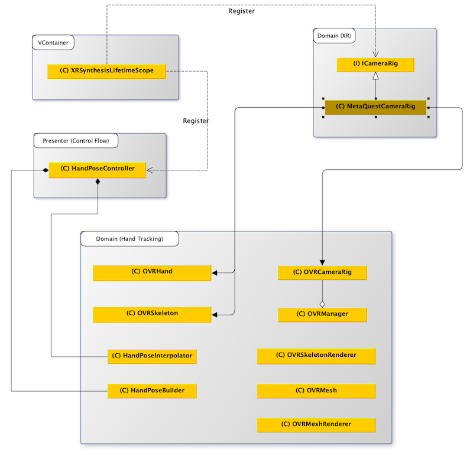

> Author: TriHD
> 
> Last updated: 24-05-2024
> 
> [Vietnamese]
# Hand Tracking For Quest

## Related Platforms
Platform   |Notes       
----------------|------------
[Mobile](../HandTracking.md)|Hand tracking for Mobile.
[Vive](./HandTracking_Vive.md)|Hand tracking for Vive.

## Flow
### Diagram


### Description
1. XRSynthesisLifetimeScope (VContainer)
````
- Đăng ký ICameraRig, ICameraRig được kế thừa bởi MetaQuestCameraRig.
- Đăng ký HandPoseController như một entry point và cập nhật xuyên suốt.
````

2. Domain (XR)
````
- MetaQuestCameraRig dùng để thiết lập tracking cho VR (head, left/right hand,....) và xử lý input từ VR.
- Tracking VR (head, left/right hand,....) sẽ được xử lý thông qua Domain (Hand Tracking).
````


3. Domain (Hand Tracking) 
- <ins>OVRManager</ins>
````
- Khởi tạo XR Device cùng với những settings thiết lập ban đầu.
````


- <ins>OVRHand</ins>
````
- Dùng để detect trạng thái của tay (active, inactive) và gesture (pinch, tracking finger confidence...).
````

- <ins>OVRSkeleton</ins>
````
- Dùng để tạo và truy xuất bone data của hand và body.
````


- <ins>OVRSkeletonRenderer</ins>
````
- Dùng để hiển thị cấu trúc xương của tay ảo.
````


- <ins>OVRMesh/OVRMeshRenderer</ins>
````
- Dùng để tạo và hiển thị mesh của tay ảo.
````


## Apply Calculated Hand Tracking Data To Avatar's Hand Model
- <ins>HandPoseBuilder</ins>
````
- Dùng để build mới một humanoid avatar bằng cách:
  + Xây khung xương body từ root.
  + Xây khung xương hand và fingers (fingers dùng bind bone poses để xây).
- Áp dụng local rotation đến từ bone poses được build từ OVRSkeleton.
- Chuyển đổi humanoid avatar thành pose handler để tính toán giá trị pose muscles sau này ở HandPoseInterpolator.
````

- <ins>HandPoseInterpolator</ins>
````
- Cập nhật hand pose của cả 2 tay (cho cả controller mode và hand tracking mode).
- Giá trị hand pose của từng tay sẽ là tổng pose muscles mặc định (từ config) và pose muscles từ hand pose builder cộng lại.
````

