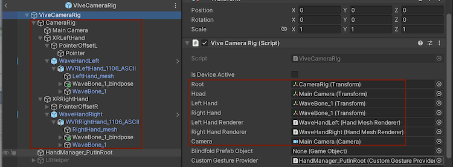
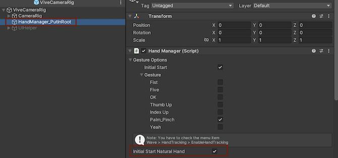
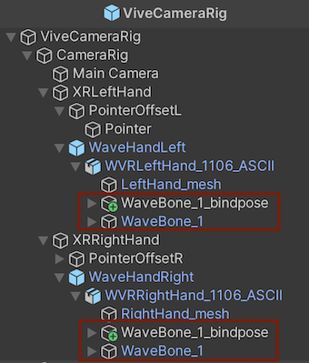
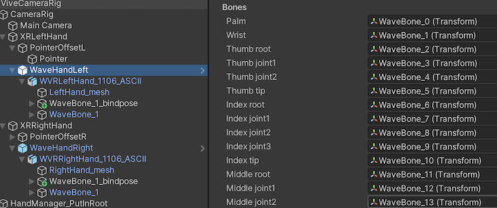
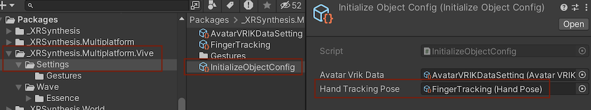
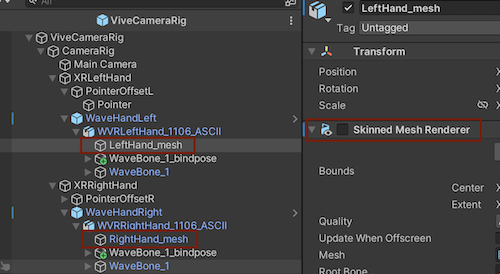

> Author: TriHD
> 
> Last updated: 24-05-2024
> 
> [Vietnamese]
# Hand Tracking For Vive

## Related Platforms
Platform   |Notes       
----------------|------------
[Mobile](../HandTracking.md)|Hand tracking for Mobile.
[Quest](./HandTracking_Quest.md)|Hand tracking for Quest.

## Flow
### Diagram


### Description
1. XRSynthesisLifetimeScope (VContainer)
````
- Đăng ký ICameraRig, ICameraRig được kế thừa bởi ViveCameraRig.
- Đăng ký HandPoseController như một entry point và cập nhật xuyên suốt.
````

2. Domain (XR)
````
- ViveCameraRig dùng để thiết lập tracking cho VR (head, left/right hand,....) và xử lý input từ VR.
- Tracking VR (head, left/right hand,....) sẽ được xử lý thông qua Domain (Hand Tracking).
````


3. Domain (Hand Tracking) 
- <ins>HandManager</ins>
````
- Khởi tạo XR Device cùng với những settings thiết lập ban đầu.
````


- <ins>HandMeshRenderer</ins>
````
- Chứa thông tin BoneMap (liên kết giữa xương cha và xương con bằng bone id).
- Khởi tạo và truy xuất bone poses và bind bone poses của tay.
  + WaveBone_1 là bone poses.
  + WaveBone_1_bindpose là bind bone poses.
````



- <ins>CustomGestureProvider</ins>
````
- Dùng để apply những gesture được thiết lập sẵn bằng settings.
````

## Apply Calculated Hand Tracking Data To Avatar's Hand Model
- <ins>HandPoseBuilder</ins>
````
- Thực hiện việc build mới một humanoid avatar bằng cách:
  + Xây khung xương body từ root.
  + Xây khung xương hand và fingers (fingers dùng bind bone poses để xây).
- Áp dụng local rotation đến từ bone poses được build từ HandMeshRenderer.
- Chuyển đổi humanoid avatar thành pose handler để tính toán giá trị pose muscles sau này ở HandPoseInterpolator.
````

- <ins>HandPoseInterpolator</ins>
````
- Cập nhật hand pose của cả 2 tay.
- Giá trị hand pose của từng tay sẽ là tổng pose muscles mặc định (từ config) và pose muscles từ hand pose builder cộng lại.
````


## Enable Virtual Vive Hand Renderer

