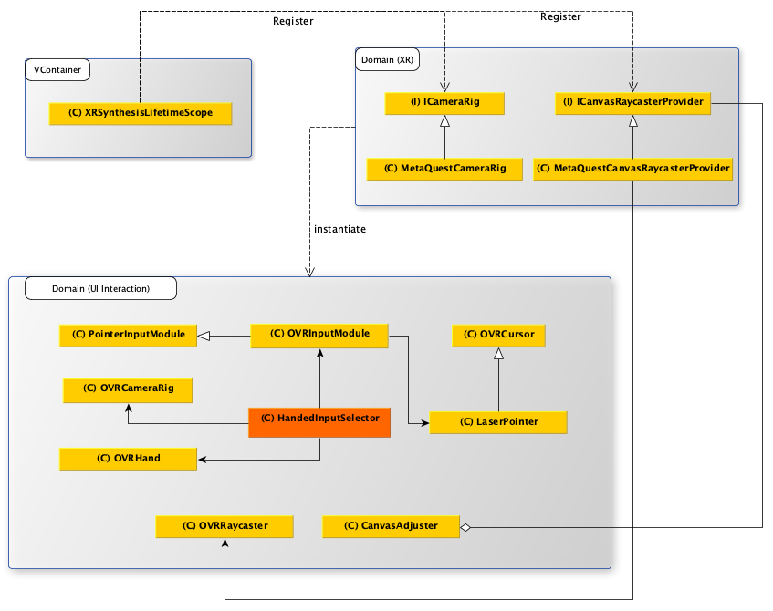
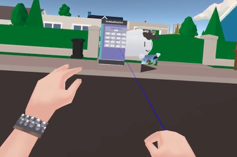

> Author: TriHD
> 
> Last updated: 28-05-2024
> 
> [Vietnamese]
# UI Interaction For Quest

## Related Platforms
Platform   |Notes       
----------------|------------
[Common](../Input.md)|Input for all platforms.
[Vive](./UI_Interaction_Vive.md)|UI interaction for Vive.

## Flow
### Diagram


### Description
1. XRSynthesisLifetimeScope (VContainer)
````
- Đăng ký ICameraRig, ICameraRig được kế thừa bởi MetaQuestCameraRig.
- Đăng ký ICanvasRaycasterProvider, ICanvasRaycasterProvider được kế thừa bởi MetaQuestCanvasRaycasterProvider.
- Nhiệm vụ của MetaQuestCanvasRaycasterProvider là cung cấp raycast component cho UI để có thể tương tác.
````

2. HandedInputSelector (Domain - UI Interaction)
````
- Kiểm tra xem đang dùng controller mode hay hand tracking mode.
- Tìm pointer pose từ OVRHand.
- Tùy thuộc vào mode tìm được ở trên mà OVRInputModule sẽ nhận ray transform như sau:
  + Hand tracking mode: nhận left/rightHandTrackingAnchor từ OVRCameraRig là ray transform.
  + Controller mode: nhận left/rightHandAnchor từ OVRCameraRig là ray transform.
- Ray transform ở trên sẽ dùng để nhận hit target (khi hit UI) và vẽ line renderer.
````


3. OVRInputModule (Domain - UI Interaction)
````
- 
````

4. OVRCameraRig (Domain - UI Interaction)
````
- 
````

5. LaserPointer (Domain - UI Interaction)
````
- 
````

6. OVRHand (Domain - UI Interaction)
````
- 
````

7. CanvasAdjuster (Domain - UI Interaction)
````
- 
````

8. OVRRaycaster (Domain - UI Interaction)
````
- 
````
