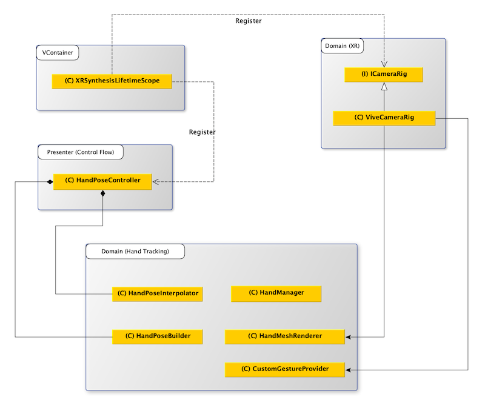

> Author: TriHD
> 
> Last updated: 27-05-2024
> 
> [Vietnamese]
# UI Interaction For Vive

## Related Platforms
Platform   |Notes       
----------------|------------
[Common](../Input.md)|Input for all platforms
[Quest](./UI_Interaction_Quest.md)|UI interaction for Quest.

## Flow
### Diagram


### Description
1. XRSynthesisLifetimeScope (VContainer)
````
- Đăng ký ICameraRig, ICameraRig được kế thừa bởi ViveCameraRig.
- Đăng ký HandPoseController như một entry point và cập nhật xuyên suốt.
````
