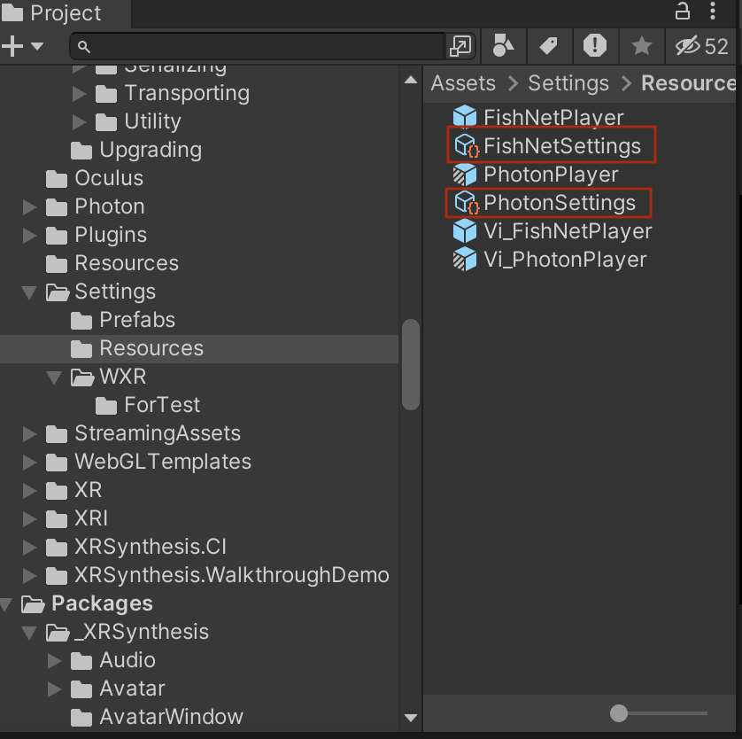
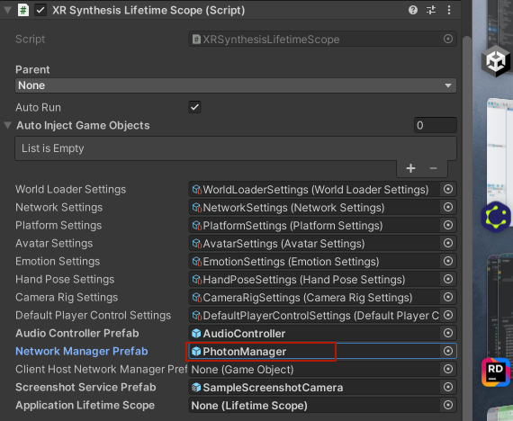
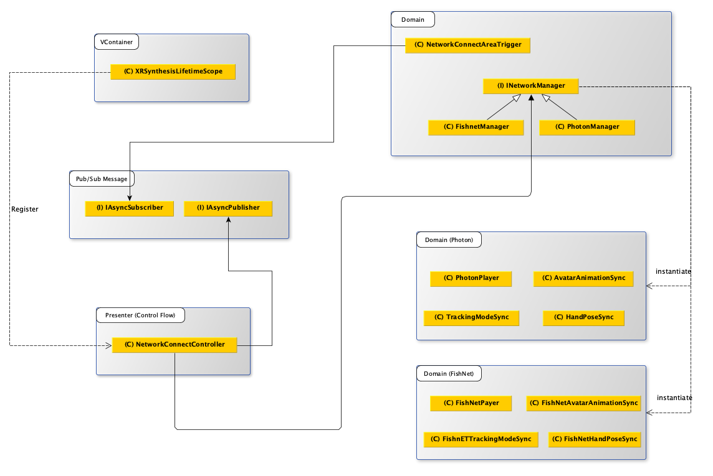

> Author: TriHD
> 
> Last updated: 08-05-2024
> 
> [[English](Eng_Ver/Networking_en.md)/Vietnamese]
# Networking

## Configuration
1. Network Settings
   


2. Network Prefabs
   


## Flow
1. Diagram


2. Description

## Setup

1. Fishnet
- Setup local server: https://docs.google.com/presentation/d/1skq_U9g1ANTi8WUn-5bG0_7vpjN2k1oVnqthiAZ7Who/edit#slide=id.g2c95909dc32_0_48

## Important Notes

1. Project Script Define Symbol (Fishnet) [25-4-2024]
````
https://visualive.atlassian.net/wiki/spaces/MET/pages/303038470
````

[VN]
> <FYI>
> Em share lại phần khách nói về nhánh nãy mtg có share sơ sơ mới team mình nha ^^
>
> Cái page dưới này note lại Fishnet connection + symbol setting
> https://visualive.atlassian.net/wiki/spaces/MET/pages/303038470
>
> hiện phần này nó đang dc thiết lập ở symbol『NETWORK_KARAOKE』
> nếu mình có phát triển tính năng gì liên quan tới fishnet or symbol thì sẽ làm trên nhánh đó
>
> nếu sau này, mình có build gì, thì trc khi build, khách có thể sẽ request mình đổi tên symbol thành『NETWORK_KARAOKE_DEMO』
> còn khách khum request thì mình để nguyên nhánh build lun khỏi đổi gì hết cũng ok

[JP]
> 以下のページの下にFishNetの接続先とシンボルの設定表があります。
> https://visualive.atlassian.net/wiki/spaces/MET/pages/303038470
>
> 何もしなければ、カラオケのブランチの時は現在は『NETWORK_KARAOKE』になっていると思います。
> 開発の時はそのまま進めてください。
>
> もし今後、VFAさんでビルドをするときに
> ビルド前に『NETWORK_KARAOKE_DEMO』に変更してくださいとお願いすることがあるかもしれません。
> お願いが無ければ変更せずビルドしてください。
>
> その時はお声がけしますので
> そのような指示があったときには『NETWORK_KARAOKE_DEMO』に変更をよろしくお願いいたします。


