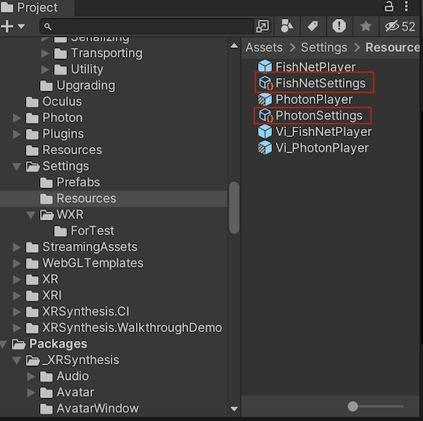

> Author: TriHD
> 
> Last updated: 10-05-2024
> 
> [[English](../Eng_Ver/Networking_en.md)/Vietnamese]
# Networking

## Configuration
1. Network Settings
- Để điều chỉnh setting cho networks (network id, max players, send rate, player prefab....), tìm 2 file settings cho 2 mạng lưới Photon và Fishnet
````
- PhotonSettings 
- FishNetSettings
````



2. Network Prefabs
- Để thay đổi mạng lưới giữa Photon và Fishnet, tìm prefab tương ứng và thay vào phần Network Manager Prefab nằm ở XRSynthesisLifetimeScope prefab


## Flow
### Diagram


### Description
1. XRSynthesisLifetimeScope (VContainer)
````
- Đăng ký NetworkConnectController như là một entry point (thực thi như là một monobehaviour).
- Entry point này sẽ chạy liên tục trong suốt qua trình xử lý network.
````

2. NetworkConnectController (Presenter - Control Flow)
````
- Dùng message pipe để broastcast tới NetworkConnectAreaTrigger. 
- Đợi sự kiện player đi vào vùng có thể connect vào network.
- Khi sự kiện trên được kích hoạt, bắt đầu connect và join room thông qua interface INetworkManager (đã injected bằng VContainer)
```` 

3. NetworkConnectAreaTrigger (Domain)
````
- Dùng message pipe để lắng nghe sự kiện từ NetworkConnectController.
````

4. INetworkManager (PhotonManger/FishNetManager) (Domain)
````
- Sau khi player kết nối vào room thành công, tạo ra một bản thể khác của nhân vật bằng prefab Vi_PhotonPlayer hoặc Vi_FishNetPlayer.
- Bản thể này dùng làm trung gian để sync data (transform, anim, hand tracking...)
- Data được sync qua lại giữa local player và remote player (cả local và remote player đều được tạo ra từ prefab WXR_Player Variant (đính kèm trong NetworkSettings))
````

5. Domain Photon/Domain Fishnet
-  Gồm những component đính kèm vào Vi_PhotonPlayer hoặc Vi_FishNetPlayer, dùng để sync data của player (WXR_Player Variant)
````
[Photon]
- PhotonPlayer.cs
- AvatarAnimationSync.cs
- TrackingModeSync.cs
- HandPoseSync.cs

[Fishnet]
- FishNetPlayer.cs
- FishNetAvatarAnimationSync.cs
- FishNetTrackingModeSync.cs
- FishNetHandPoseSync.cs
````

## Setup

1. Fishnet
- Setup local server: https://docs.google.com/presentation/d/1skq_U9g1ANTi8WUn-5bG0_7vpjN2k1oVnqthiAZ7Who/edit#slide=id.g2c95909dc32_0_48

## Important Notes

1. Project Script Define Symbol (Fishnet) [25-4-2024]
````
https://visualive.atlassian.net/wiki/spaces/MET/pages/303038470
````

[VN]
> <FYI>
> Em share lại phần khách nói về nhánh nãy mtg có share sơ sơ mới team mình nha ^^
>
> Cái page dưới này note lại Fishnet connection + symbol setting
> https://visualive.atlassian.net/wiki/spaces/MET/pages/303038470
>
> hiện phần này nó đang dc thiết lập ở symbol『NETWORK_KARAOKE』
> nếu mình có phát triển tính năng gì liên quan tới fishnet or symbol thì sẽ làm trên nhánh đó
>
> nếu sau này, mình có build gì, thì trc khi build, khách có thể sẽ request mình đổi tên symbol thành『NETWORK_KARAOKE_DEMO』
> còn khách khum request thì mình để nguyên nhánh build lun khỏi đổi gì hết cũng ok

[JP]
> 以下のページの下にFishNetの接続先とシンボルの設定表があります。
> https://visualive.atlassian.net/wiki/spaces/MET/pages/303038470
>
> 何もしなければ、カラオケのブランチの時は現在は『NETWORK_KARAOKE』になっていると思います。
> 開発の時はそのまま進めてください。
>
> もし今後、VFAさんでビルドをするときに
> ビルド前に『NETWORK_KARAOKE_DEMO』に変更してくださいとお願いすることがあるかもしれません。
> お願いが無ければ変更せずビルドしてください。
>
> その時はお声がけしますので
> そのような指示があったときには『NETWORK_KARAOKE_DEMO』に変更をよろしくお願いいたします。
