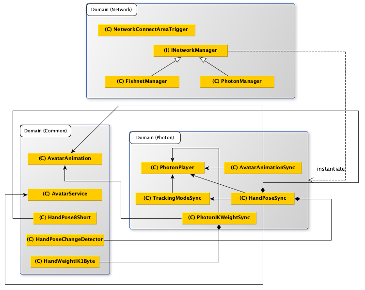
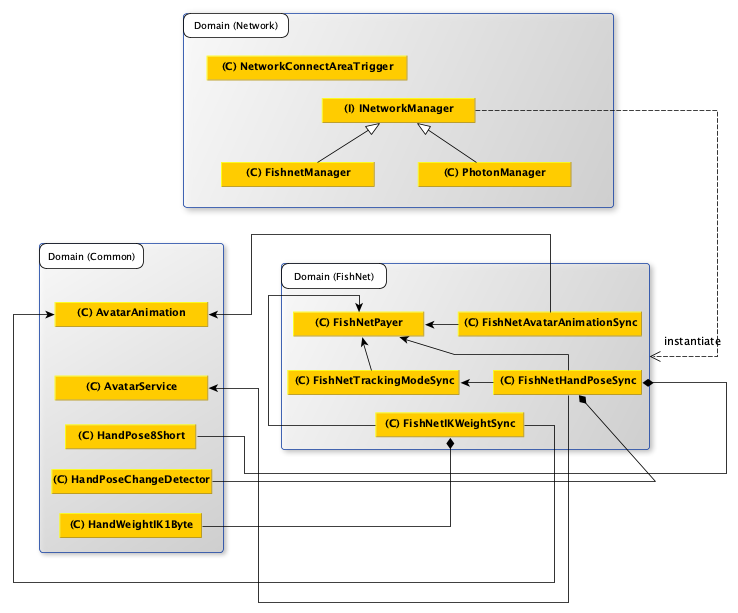
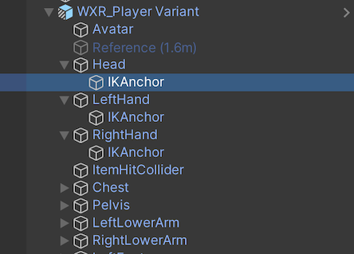
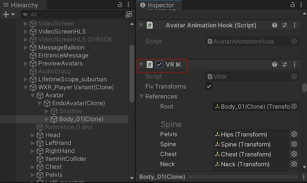

> Author: TriHD
> 
> Last updated: 26-05-2024
> 
> [Vietnamese]
# Player Data Sync

## Before We Start
- Hãy đọc hiểu phần Networking trước khi tiếp tục: [Click here](./Networking.md)

## Flow
### Diagram
1. Photon
   


2. Fishnet
   

   
### Description
1. PhotonPlayer/FishNetPayer (Domain Photon/Fishnet)
````
- Khởi tạo player prefab từ NetworkSettings (WXR_Player Variant)
- Sync avatar status giữa local và remote player.
- Sync toàn bộ IKAnchor (headIKAnchor, left/rightHandIKAnchor, ...) giữa local và remote player thông qua:
  + Vi_PhotonPlayer đối với Photon.
  + Vi_FishNetPlayer đối với Fishnet.
- IKAnchor (headIKAnchor, left/rightHandIKAnchor, ...) được sync thay vì parent của nó (Head, Left/RightHand...) để:
  + Tránh sự xung đột về config giữa các platform với nhau.
  + Ví dụ như Vive và Quest có config rotation/position offset cho IKAnchor khác nhau.
    => Nếu đang ở Quest và sync parent của IKAnchor (Left/RightHand...) sẽ dẫn tới platform Vive sẽ nhận giá trị sai.
````


2. AvatarAnimationSync/FishNetAvatarAnimationSync (Domain Photon/Fishnet)
````
- Sync trạng thái của avatar animation. Ví dụ như jump action.
````

3. TrackingModeSync/FishNetTrackingModeSync (Domain Photon/Fishnet)
````
- Sync tracking mode để kiểm tra xem:
  + Nếu tracking mode là VR mode ở dạng ThreePointTracking (1 head + 2 hands) hoặc FullTracking thì enable VRIK component.
  + Nếu tracking mode là Non-VR thì disable VRIK component.
````


4. HandPoseSync/FishNetHandPoseSync (Domain Photon/Fishnet)
````
- Sync hand pose (left/right hand fingers và left/right hand weight) qua remote player.
- Sync theo tỉ lệ nhất định (send rate) trong 1s. Ví dụ 100ms sẽ sync 1 lần => 1s sync 10 lần.
- Chỉ sync khi phát hiện sự thay đổi về local rotation của hand fingers hoặc giá trị weight của hand weight.
````
   - <ins>HandPoseChangeDetector</ins>
       - Kiểm tra sự thay đổi của local rotation từ hand fingers trước khi sync.
         
   - <ins>HandPose8Short</ins>
       - Nén giá trị pose của từng fingers từ float thành short để tối ưu băng thông.
       - Quy tắc nén:
         + Giá trị pose sẽ là số float nằm trong range [f1, f2].
         + Chuyển đổi range này thành range short [s1, s2] với sai số cho phép (Ví dụ 10% sai số).
           => Ví dụ: [-1f, 1f] chuyển thành [0, 15].
         + Tại sao lại là 0 -> 15 ?
           => Vì 0 -> 15 sẽ nhét gọn trong 4 bits (15 = 1111).
         + Vì 1 finger (ví dụ left index finger) sẽ có 4 pose:
           - LeftIndex1Stretched, LeftIndexSpread, LeftIndex2Stretched, LeftIndex3Stretched.
           - 4 pose sẽ nhét được thành 16 bits (= 1 short = 2 bytes) thay vì gửi 4 float (= 16 bytes) cho 4 pose.
       - Quy tắc giải nén:
         + Remote player nhận được 1 short của finger pose sẽ giải nén ngược lại bằng cách:
           - Mask từng cụm 4 bit từ 1 short đã nén để thu được giá trị của từng pose nằm trong [s1, s2] = [0, 15].
           - Chuyển đổi range này thành range float [f1, f2] = [-1f, 1f] (có sai số ví dụ là 10% như lúc nén).
           - Apply giá trị đã giải nén này vào finger pose.
           
   - <ins>HandWeightIK1Byte</ins>
       - Nén giá trị weight của từng left/right hand từ float thành byte để tối ưu băng thông.
       - Quy tắc nén sẽ giống như HandPose8Short nhưng:
         + Giá trị weight sẽ là số float nằm trong range [f1, f2] = [-1f, 1f].
         + Có tất cả 2 tay (left và right hand) => Chỉ cần nén xuống 1 byte là đủ.
       - Quy tắc giải nén sẽ giống như HandPose8Short.
         
## Important Notes
1. HandPose8Short
   - Tùy vào từng platform và loại controller input mà range [f1, f2] sẽ có sự thay đổi. Ví dụ:
       + Quest dùng controller sẽ là [-1f, 1f] và hand tracking sẽ là [-2f, 2f].
       + Vive dùng hand tracking sẽ là [-2f, 2f].
       + Mobile dùng hand tracking sẽ là [f1, f2] (chưa xác định, cần test thử giá trị finger pose để biết chính xác).
