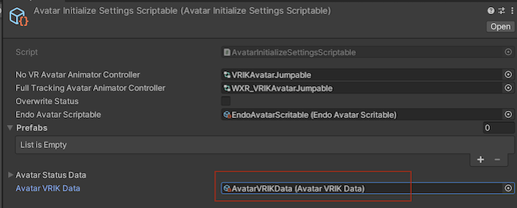
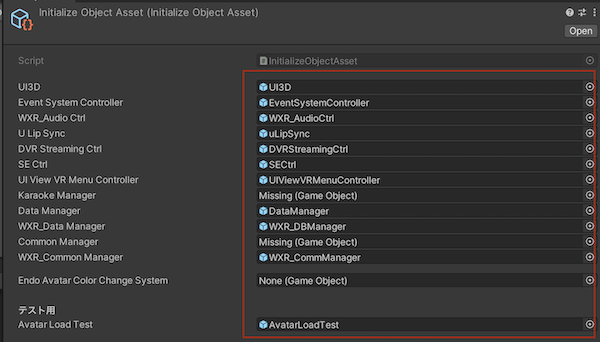
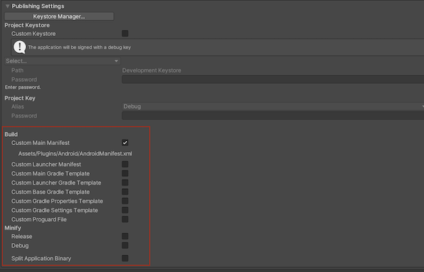
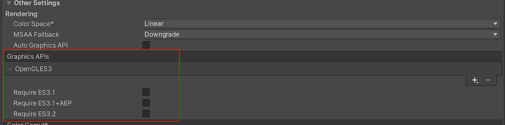

> Author: TriHD
> 
> Last updated: 08-05-2024
> 
> [[English](Eng_Ver/PlatformSwitcher_en.md)/Vietnamese]
# Overview

## Switch platform

- Việc đổi platform sẽ thay đổi build targets, packages, camera rig, XR Plugin Management plugins, player settings, game settings (ex: HandPoseSettings, InitializeObjectAsset,...)
- Không nên đổi platform ở build settings, thay vào đó hãy chọn thông qua menu:

  > XRSynthesis/Multiplatform/Switch/<target_platform>


Hiện tại chủ yếu làm việc trên những platform
````
- Quest
- Vive
- Windows (OpenXR) (Meta Quest)
- Mobile (Android/iOS)
````

Những platform sẽ làm việc trong tương lai
````
- Apple Vision Pro
````

## XRSynthesis Settings

1. Khi switch platform, sẽ có những thay đổi sẽ xảy ra ở những setting nằm trong prefab XRSynthesis.


2. Những setting sẽ thay đổi bao gồm
````
- HandPoseSettings
- CameraRigSettings
- AvatarInitializeSettingsScriptable
- InitializeObjectAsset
````


3. Nội dung AvatarInitializeSettingsScriptable
```` 
- Phần này thay đổi AvatarVRIKDataSetting.
- AvatarVRIKDataSetting dùng để lưu data IK Anchor cho toàn bộ phần body (head, hand, chest,….) khi dùng controller hoặc hand tracking.
````



4. Nội dung CameraRigSettings
```` 
- Thay đổi prefab camera rig.
- Prefab camera rig sẽ dung để chạy setup camera VR cho platform đó.
````    


5. Nội dung HandPoseSettings
````
- Thay đổi Hand Tracking Pose asset.
- Hand Tracking Pose asset dùng để thiết lập finger pose cho 2 tay khi dung hand tracking.
- Phần Hand Poses là settings cho từng thao tác khi dùng controller.
````


6. Nội dung InitializeObjectAsset
````
- Thay đổi những prefab cần thiết để chạy UI, event system, data manager…
````



## 3.	Platform Packages

Mỗi khi chuyển sang 1 platform sẽ cần có những packages cần thiết đi kèm từ 2 nguồn:
````
- Install từ LocalPackages
- Install package name từ Unity Package Manager 1 cách tự động
````

1. Install từ LocalPackages
   


- Bên trong folder LocalPackages
  


````
- Mỗi platform sẽ yêu cầu những package riêng.
Ví dụ:
[Quest]
    + XRSynthesis.Multiplatform.MetaQuest (từ LocalPackages)
    + Oculus XR Plugin (từ package manager com.unity.xr.oculus@4.0.0)

[Vive]
    + XRSynthesis.Multiplatform.Vive (từ LocalPackages)
    + ViveWaveXR/WaveEssence (từ LocalPackages)	
    + ViveWaveXR/WaveNative (từ LocalPackages)
    + ViveWaveXR/WaveXRSdk (từ LocalPackages)
````

## Project Settings
Mỗi platform sẽ có 1 sự thay đổi khác nhau về những phần ở dưới đây:

1. Thay đổi về Custom Build



2. Thay đổi về Graphic Api



3. Thay đổi về Platform Data


4. Thay đổi về Player Platform Settings


5. Thay đổi về Script Define Symbol


6. Thay đổi về Targe/Minimum Api Level
   


7. Thay đổi về XR Management
   


## Implementation
````
- PlatformSwitcherMenu.cs
- PlatformSwitcher.cs
- PackageName.cs
- XRPluginManagementSettings.cs
- ScriptingDefineSymbolsModifier.cs
- PlayerManagementSettings.cs
- PlayerPlatformSettings.cs
````
