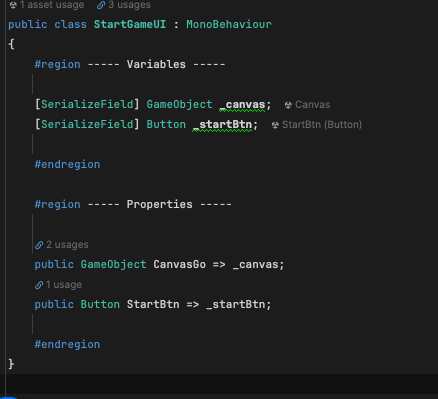

> Author: TriHD
> 
> Last updated: 24-05-2024
> 
> [English/[Vietnamese](../Architecture.md)]
# Architecture

1. Description

   
2. Diagram

  
# Example
> Requirement: create a simple UI with a Dim background showing the text "Click To Start" and wait for a click event on the UI to turn it off.
>
> Demo: https://drive.google.com/file/d/1GLJ80tvvxMHhwU5gyTFrwwL2t0Ts7w9-/view?usp=sharing

1. VContainer Layer (WXR_LifeTimeScope)
````
- DI container WXR LifeTimeScope will create a child prefab located in a new scope. It's LifeTimeScope script attached to WXR_StartGameUI prefab.
- This new Scope is enqueueed into the parent WXR_LifeTimeScope (in other words, WXR_LifeTimeScope is the parent of the new Scope).
````


2. Domain Layer + Pub/Sub Message (StartGameState)
````
- When successfully initializing the new scope above, run StartGameState to handle the logic of the Domain Layer (run startGameState.Run() in the image in the step above).
- StartGameState will use pub/sub message to wait for the process to completion on Presentation Layer.
- To be clear, StartGameState will wait for the ShowUI part to complete and then wait for the HideUI part (await the click event on the UI to finish).
- At this time, StartGameState is done completely.
````


3. Presentation Layer + Pub/Sub Message (StartGamePresenter)
````
- This layer takes responsibility to connect the Domain Layer and View Layer to separate the control logic from them.
- StartGamePresenter will subscribe to pub/sub messages to listen for publish events from the Domain Layer and handle logic after that.
- The ShowUIAsync method will simply wait for the click event on the UI and finish.
````


4. View Layer (StartGameUI)
````
- This layer only contains view script (often Monobehaviour) and does not contain any domain or control logic inside.
````



# Demo
````
https://drive.google.com/file/d/1GLJ80tvvxMHhwU5gyTFrwwL2t0Ts7w9-/view?usp=sharing
````  

