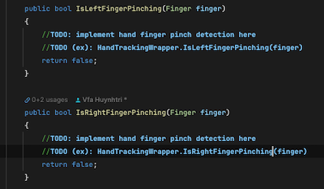

> Author: TriHD
> 
> Last updated: 28-05-2024
> 
> [[Japanese](./Languages/HandTracking_jp.md)/Vietnamese]
# Hand Tracking For Mobile

## Before We Start
- Có nhiều hình tĩnh png và hình động gif đính kèm trong document này.
- Nên đợi load hết rồi bắt đầu đọc để tránh lướt qua những thông tin cần thiết.

## Related Platforms
Platform   |Notes       
----------------|------------
[Quest](./Platforms/HandTracking_Quest.md)|Hand tracking for Quest.
[Vive](./Platforms/HandTracking_Vive.md)|Hand tracking for Vive.

## Flow
### Diagram


### Description
1. XRSynthesisLifetimeScope (VContainer)
````
- Đăng ký ICameraRig, ICameraRig được kế thừa bởi MobileCameraRig.
- Đăng ký IVRModeProvider, IVRModeProvider được kế thừa bởi MobileVRModeProvider.
````

2. Domain (XR)
````
- MobileCameraRig dùng để thiết lập tracking cho VR (head, left/right hand,....) và xử lý input từ VR.
- Tracking VR (head, left/right hand,....) sẽ được xử lý thông qua Domain (Hand Tracking).
- MobileVRModeProvider dùng để kiểm soát những phần xử lý khi chuyển đổi qua lại giữa non-VR mode và VR mode.
````


3. Domain (Hand Tracking) 
- <ins>MobileHandTrackingManager</ins>
````
- Đọc dữ liệu handlandmark và handedness từ MobileHandTrackingDetection.
- Khử nhiễu dữ liệu đầu vào bằng HandNoiseDetection.
- Phân chia dữ liệu đã khử cho tay trái và tay phải thông qua IMobileHand.
- Cập nhật xử lý cho tay trái/phải.
````

- <ins>HandNoiseDetection</ins>
````
- Đọc dữ liệu handlandmark và handedness.
- Khử nhiễu bằng cách:
  + Phát hiện sự thay đổi đột ngột của trạng thái tay (active/inactive)
  + Giữ nguyên trong x frame (x sẽ được điều chỉnh tùy theo cảm nhận khi test) trước khi chấp nhận sự thay đổi. 
- Xử lý nhiễu cho cả 2 trường hợp là 1 tay và 2 tay.
````

- <ins>MobileHandTrackingDetection</ins>
````
- Khởi tạo hand tracking graph (MobileHandTrackingGraph). 
- Khởi tạo camera device (MobileCameraDevice).
- Camera device sẽ đọc texture frame từ webcam device.
````

- <ins>MobileCameraDevice</ins>
````
- Xử lý phần detect webcam devices (rear, front, wide angle hay ultra wide angle...).
- Start/Run/Pause/Resume/Stop phần xử lý webcam texture (dùng để làm input cho texture frame bên tracking graph).
````

- <ins>MobileHandTrackingGraph</ins>
````
- Thiết lập settings và data cho graph từ HandTrackingConfig.cs
- Graph sẽ nhận texture frame từ MobileHandTrackingDetection và xử lý.
- Trả dữ liệu tracking bao gồm landmark và handedness về cho MobileHandTrackingDetection.
````

- <ins>MobileHand</ins>
````
- Dùng data 2D của mediapipe landmark để tính toán vị trí world.
- Ứng dụng vị trí world để tạo ra tay skeleton ảo (handlandmark).
- Tính toán tracking depth để tất cả handlandmark có chiều sâu.
- Tính toán vị trí và góc xoay của handlandmark anchor (wrist) để apply vào avatar's left/right hand anchor.
- Tìm bone poses và bind bone poses (bind/bone pose phải tự build dựa trên phần tính toán ở trên).
- Tính toán góc xoay của bone poses (từng đốt ngón tay) dựa trên handlandmark.
- Bind bone poses dùng để tạo ra trạng thái ban đầu cho phần tự build humanoid avatar.
````


- <ins>MobileHandRenderer</ins>
````
- Xử lý hiển thị render cho:
  + Tay skeleton ảo (mô phỏng dữ liệu đã được convert từ mediapipe landmark).
  + Tay build từ bone poses (dùng để thể hiện góc xoay của từng đốt ngón tay).
  + Tay build từ bine bone poses (dùng để setup cho phần build humanoid avatar).
````


- <ins>HandTrackingWrapper</ins>
````
- Tạo ra những api cần thiết cho việc truy cập liên quan đến tracking:
  + Lấy trạng thái tay (active/inactive).
  + Lấy bone pose/bind bone pose.
  + Start/Pause/Stop/Resume xử lý hand tracking.
  + Những phần xử lý khác nếu cần thì implement trong phần wrapper này.
- Mục đích là để clean code cho phần Domain (Hand Tracking) và không cần quan tâm nhiều tới phần xử lý bên dưới.
````

## Apply Calculated Hand Tracking Data To Avatar's Hand Model
- Cơ chế xử lý tương tự như Quest/Vive.
- Xem phần **Apply Calculated Hand Tracking Data To Avatar's Hand Model** ở:
  + [Quest](./Platforms/HandTracking_Quest.md)
  + [Vive](./Platforms/HandTracking_Vive.md)

## How To Debug In Editor
1. <ins>Script symbol</ins>
    - Thêm symbol DEBUG_HAND_TRACKING_MOBILE.


   
2. <ins>VRPlayerMovement.cs</ins>
    - Thêm phần method ReflectTracking2 như bên dưới.
    - Trong method Update bổ sung DEBUG_HAND_TRACKING_MOBILE symbol + method ReflectTracking2 như bên dưới (nếu chưa có).

```cs
void ReflectTracking2()
{
    if (Player.Self == null)
        return;
            
    // // 頭部のリフレクトトラッキング (Reflect Tracking for Head)
    // Player.Self.Head.SetPositionAndRotation(
    //     cameraRig.Head.position,
    //     cameraRig.Head.rotation);

    // RightHandActive = true の場合にのみ右手のトラッキングを反映
    // (Reflect Tracking for Right hand only when RightHandActive = true)
    if (cameraRig.RightHandActive)
    {
        Player.Self.RightHand.SetPositionAndRotation(
            cameraRig.RightHand.position,
            cameraRig.RightHand.rotation);
    }

    // LeftHandActive = true の場合にのみ左手のトラッキングを反映
    // (Reflect Tracking for Left hand only when LeftHandActive = true)
    if (cameraRig.LeftHandActive)
    {
        Player.Self.LeftHand.SetPositionAndRotation(
            cameraRig.LeftHand.position,
            cameraRig.LeftHand.rotation);
    }

#if PLATFORM_WINDOWS
            //SteamVR用フルトラの同期
            XRICameraRig xRICameraRig = (XRICameraRig)cameraRig;
            Player.Self.Pelvis.SetPositionAndRotation(
                xRICameraRig.Waist.position,
                xRICameraRig.Waist.rotation);
            Player.Self.LeftFoot.SetPositionAndRotation(
                xRICameraRig.LeftFoot.position,
                xRICameraRig.LeftFoot.rotation);
            Player.Self.RightFoot.SetPositionAndRotation(
                xRICameraRig.RightFoot.position,
                xRICameraRig.RightFoot.rotation);
#endif
}
```

```cs
private void Update()
{
#if DEBUG_HAND_TRACKING_MOBILE
    ReflectTracking2();
#endif
    UpdateWeightWhenLostOrResumeHandTracking();
}
```

3. <ins>HandPoseController.cs</ins>
    - Trong phần method LateTick bổ sung DEBUG_HAND_TRACKING_MOBILE symbol như bên dưới (nếu chưa có).

```cs
public void LateTick()
{
            if (Player.Self == null) return;
#if !DEBUG_HAND_TRACKING_MOBILE
            if (Player.Self.AvatarService.TrackingMode == TrackingMode.NonVR) return;
#endif
            if (Player.Self.AvatarService.Animator == null) return;
            ...
}           
```

4. <ins>MobileVRModeProvider.cs</ins>
    - Trong phần method Update bổ sung DEBUG_HAND_TRACKING_MOBILE symbol như bên dưới (nếu chưa có).

```cs
void Update()
{
    if (xrStateManager.VREnabled.Value)
    {
        if (Api.IsCloseButtonPressed)
            xrStateManager.ToggleVR();
        
        Api.UpdateScreenParams();
    }
    
#if !DEBUG_HAND_TRACKING_MOBILE 
    if (isHandTrackingInitialized)
    {
        var isVREnabled = xrStateManager.VREnabled.Value;
        if (!isVREnabled)
            HandTrackingWrapper.PauseHandTracking();
        else 
            HandTrackingWrapper.ResumeHandTracking();
    }
#endif
}
```

5. <ins>Chuyển sang First Person View</ins>
```
- Ấn vào icon camera (khoanh đỏ) như trong hình
```


6. <ins>Bật VR IK</ins>
```
- Enable component VRIK
```


```
- Giơ 2 tay trước front-facing camera của Editor
```


7. <ins>Hiện render của bàn tay ảo</ins>
```
- Chọn Enable Renderer cho tay trái
```


```
- Chọn Enable Renderer cho tay phải
```


```
- Giơ 2 tay trước front-facing camera của Editor
```


8. <ins>Tìm chỗ hiện render của Bone Map</ins>
```
- BoneMap nằm trong LeftHandMobile và RightHandMobile gameobject
```


```
- Tìm vị trí hiện render BoneMap (Bone Poses) trên Scene View
```


## Remaining Tasks
1. <ins><b>The appearance of jitter in the movement</b></ins>
```
- Trên device yếu, phần di chuyển của bàn tay không được mượt mà và bị giật (teleport) giữa các frame.
- Giải pháp là áp dụng interpolation vào phần movement và rotation của hand giữa các frame.
```


2. <ins><b>Hand Gestures with front-facing camera</b></ins>
- <b>Trường hợp góc nhìn người thứ ba (Third Person View)</b>
    - Điều chỉnh phần detect loại camera (front hoặc rear) theo platform ở HandTrackingConfig.

    - Phần nhận data của landmark và handedness nằm ở MobileHandTrackingManager.

    - Tắt phần xử lý 2 tay để tránh tracking hand anchor và hand fingers ở MobileHandTrackingManager.

    - Implement tính năng hand gesture. Gợi ý: ví dụ tạo HandGestureRecognition.cs và chạy xử lý composition này ở MobileHandTrackingManager.
    - Tiếp theo là thêm api vào HandTrackingWrapper (ví dụ như IsLeftFingerPinching(Finger finger)).
    - Bổ sung phần detect ngón tay được pinch vào MobileCameraRig.
    - 
  
- <b>Trường hợp góc nhìn người thứ nhất (First Person View)</b>
    - Tương đối giống với phần góc nhìn thứ 3.
    - Nếu khách yêu cầu tracking cả 2 tay (hand anchor + hand fingers) thì không tắt phần xử lý ở MobileHandTrackingManager.

    - Implement thêm phần hand gesture như góc nhìn người thứ ba ở trên.

3. <ins><b>UI interaction with ray pointer</b></ins>
- Task này nên hỏi khách hàng trước khi làm.
- Tham khảo phần sample của Google VR sdk và custom lại theo nhu cầu của khách hàng.

