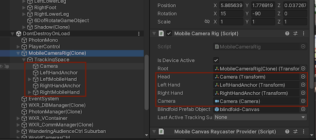
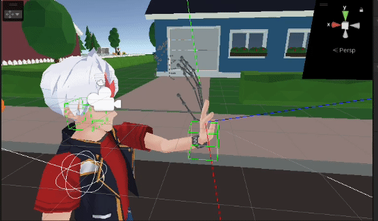
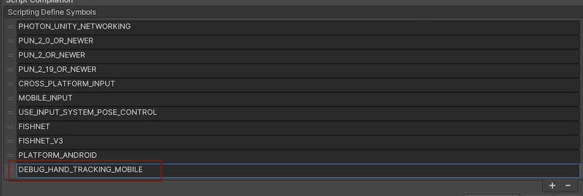
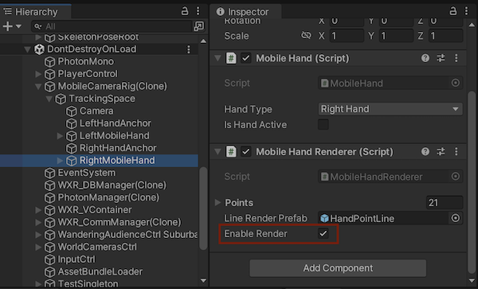

> Author: TriHD
> 
> Last updated: 28-05-2024
> 
> [Japan/[Vietnamese](../HandTracking.md)]
# Hand Tracking For Mobile

## Before We Start
- このドキュメントには多数の静止画 PNG 画像とアニメーション GIF 画像が添付されています
- 重要な情報を見逃さないように、ダウンロードが完了するまで待ってから読み始める必要があります。

## Related Platforms
Platform   |Notes       
----------------|------------
[Quest](../Platforms/HandTracking_Quest.md)|Hand tracking for Quest.
[Vive](../Platforms/HandTracking_Vive.md)|Hand tracking for Vive.

## Flow
### Diagram


### Description
1. XRSynthesisLifetimeScope (VContainer)
````
- ICameraRigを登録します。ICameraRigがMobileCameraRigに継承されます。
- IVRModeProvider を登録します。IVRModeProvider は MobileVRModeProvider に継承されます。
````

2. Domain (XR)
````
- MobileCameraRig は、VR のトラッキング (頭、左手/右手など) を設定し、VR からの入力を処理するために使用されます。
- トラッキング VR (頭、左手/右手など) はドメイン (ハンド トラッキング) を通じて処理されます。
- MobileVRModeProviderは、nonVRモードとVRモードを切り替える際の処理を制御するために使用されます。
````


3. Domain (Hand Tracking) 
- <ins>MobileHandTrackingManager</ins>
````
- MobileHandTrackingDetection から handlandmark と handedness を読み取ります。
- HandNoiseDetection を使用して入力データのノイズを除去します。
- IMobileHand 経由でノイズ除去されたデータを左手と右手に分割します。
- 左手と右手のハンドリングを更新します。
````

- <ins>HandNoiseDetection</ins>
````
- handlandmark と handedness のデータを読み取ります。
- 次の方法でノイズを除去します。
  + 手の状態の突然の変化を検出します。(active/inactive)
  + 変更を受け入れる前に、x フレームを同じにしておきます (x はテスト時の感触に応じて調整されます)。
- 片手と両手どちらの場合もノイズ処理します。
````

- <ins>MobileHandTrackingDetection</ins>
````
- ハンド トラッキング グラフ (MobileHandTrackingGraph) を初期化します。
- カメラデバイス(MobileCameraDevice)を初期化します。
- カメラ デバイスは、Web カメラ デバイスからテクスチャ フレームを読み取ります。
````

- <ins>MobileHandTrackingGraph</ins>
````
- HandTrackingConfig.cs からグラフの設定とデータをセットアップします。
- グラフはMobileHandTrackingDetectionからテクスチャフレームを受け取り、それを処理します
- Landmark や handedness を含むトラッキングデータを MobileHandTrackingDetection に返します。
````

- <ins>MobileHand</ins>
````
- landmark mediapipe landmark の 2D データを使用してワールド位置を計算します
- ワールド位置を適用して仮想 skeleton ハンド (ハンドランドマーク) を作成します。
- すべてのハンドランドマークに深度があるようにトラッキング深度を計算します。
- アバターの左手/右手に適用するのためハンドランドマーク アンカー (手首) の位置と回転角度を計算します。
- bone poses と bind bone poses を検索します(バインド/ボーン ポーズは、上記の計算に基づいて自分で構築する必要があります)。
- ハンドランドマークに基づいてボーンポーズ(各関節)の回転角度を計算します。
- バインド ボーン ポーズは、humanoid avatar ビルドの初期状態を作成するために使用されます。
````


- <ins>MobileHandRenderer</ins>
````
- 以下のレンダリングを処理します：
  + 仮想スケルトンハンド (メディアパイプランドマークから変換されたデータをシミュレートします)。
  + bone poses から構築された手は、各関節の回転角度を示すために使用されます。
  + bine bone poses からのビルド手は、humanoid avatarビルドパーツのセットアップに使用されます。
````


- <ins>HandTrackingWrapper</ins>
````
- Tトラッキング関連のアクセスに必要な 各API を作成する：
  + ハンドのステータス (アクティブ/非アクティブ) を取得します。
  + bone pose/bind bone poseを取得します。
  + 開始/一時停止/停止/再開（ Start/Pause/Stop/Resume）はハンドトラッキングを処理します。
  + 必要に応じて、その他の処理部分はこのラッパー（ wrapper ）に実装されます。
- 目的はドメイン (ハンド トラッキング) 部分のコードをクリーンにすることであり、以下の処理にはあまり注意を払う必要はありません。
````

## Apply Calculated Hand Tracking Data To Avatar's Hand Model
- 処理メカニズムはQuest/Viveに似ています
- **Apply Calculated Hand Tracking Data To Avatar's Hand Model** セクションを参照してください。:
  + [Quest](./Platforms/HandTracking_Quest.md)
  + [Vive](./Platforms/HandTracking_Vive.md)

## How to debug in Editor
1. <ins>Script symbol</ins>
    - シンボル DEBUG_HAND_TRACKING_MOBILE を追加


   
2. <ins>VRPlayerMovement.cs</ins>
    - 以下のように ReflectTracking2 メソッド セクションを追加します
    - 更新 メソッドに、以下のように DEBUG_HAND_TRACKING_MOBILE シンボルと ReflectTracking2 メソッドを追加します (まだ存在しない場合)。

```cs
void ReflectTracking2()
{
    if (Player.Self == null)
        return;
            
    // // 頭部のリフレクトトラッキング (Reflect Tracking for Head)
    // Player.Self.Head.SetPositionAndRotation(
    //     cameraRig.Head.position,
    //     cameraRig.Head.rotation);

    // RightHandActive = true の場合にのみ右手のトラッキングを反映
    // (Reflect Tracking for Right hand only when RightHandActive = true)
    if (cameraRig.RightHandActive)
    {
        Player.Self.RightHand.SetPositionAndRotation(
            cameraRig.RightHand.position,
            cameraRig.RightHand.rotation);
    }

    // LeftHandActive = true の場合にのみ左手のトラッキングを反映
    // (Reflect Tracking for Left hand only when LeftHandActive = true)
    if (cameraRig.LeftHandActive)
    {
        Player.Self.LeftHand.SetPositionAndRotation(
            cameraRig.LeftHand.position,
            cameraRig.LeftHand.rotation);
    }

#if PLATFORM_WINDOWS
            //SteamVR用フルトラの同期
            XRICameraRig xRICameraRig = (XRICameraRig)cameraRig;
            Player.Self.Pelvis.SetPositionAndRotation(
                xRICameraRig.Waist.position,
                xRICameraRig.Waist.rotation);
            Player.Self.LeftFoot.SetPositionAndRotation(
                xRICameraRig.LeftFoot.position,
                xRICameraRig.LeftFoot.rotation);
            Player.Self.RightFoot.SetPositionAndRotation(
                xRICameraRig.RightFoot.position,
                xRICameraRig.RightFoot.rotation);
#endif
}
```

```cs
private void Update()
{
#if DEBUG_HAND_TRACKING_MOBILE
    ReflectTracking2();
#endif
    UpdateWeightWhenLostOrResumeHandTracking();
}
```

3. <ins>HandPoseController.cs</ins>
    - LateTick メソッド セクションに、以下のように DEBUG_HAND_TRACKING_MOBILE シンボルを追加します (まだ存在しない場合)。

```cs
public void LateTick()
{
            if (Player.Self == null) return;
#if !DEBUG_HAND_TRACKING_MOBILE
            if (Player.Self.AvatarService.TrackingMode == TrackingMode.NonVR) return;
#endif
            if (Player.Self.AvatarService.Animator == null) return;
            ...
}           
```

4. <ins>MobileVRModeProvider.cs</ins>
    - 更新メソッドセクションに、以下のように DEBUG_HAND_TRACKING_MOBILE シンボルを追加します (まだ存在しない場合)。

```cs
void Update()
{
    if (xrStateManager.VREnabled.Value)
    {
        if (Api.IsCloseButtonPressed)
            xrStateManager.ToggleVR();
        
        Api.UpdateScreenParams();
    }
    
#if !DEBUG_HAND_TRACKING_MOBILE 
    if (isHandTrackingInitialized)
    {
        var isVREnabled = xrStateManager.VREnabled.Value;
        if (!isVREnabled)
            HandTrackingWrapper.PauseHandTracking();
        else 
            HandTrackingWrapper.ResumeHandTracking();
    }
#endif
}
```

5. <ins>人称視点に切り替える</ins>
```
- 以下の画像のようなカメラアイコン（赤丸）をクリックします。
```


6. <ins>Bật VR IK</ins>
```
- VRIK コンポーネントを有効にする
```


```
- エディターの正面カメラの前で両手を上げる
```


7. <ins>仮想手のレンダリングを表示</ins>
```
- 左手のレンダラー（ Renderer）を有効にするを選択します
```


```
- 右手のレンダラー（ Renderer）を有効にするを選択します
```


```
- エディターの正面カメラの前で両手を上げる
```


8. <ins>ボーン マップ レンダリングが表示される場所を見つける</ins>
```
- BoneMap は LeftHandMobile および RightHandMobile ゲームオブジェクトにあります
```


```
- シーン ビューで BoneMap (Bone Poses) のレンダリング位置を見つけます。
```


## Remaining Tasks
1. The appearance of jitter in the movement
```
- 弱いデバイスでは、手の動きがスムーズでなく、フレーム間でガクガク・ブルブル (テレポート) します。
- 解決策は、フレーム間の手の動きと回転に補間(interpolation)を適用することです。
```

