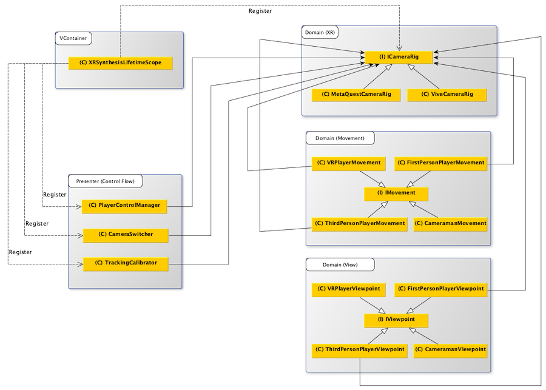

> Author: TriHD
> 
> Last updated: 27-05-2024
> 
> [Vietnamese]
# Input

## Flow
### Diagram


### Description
1. XRSynthesisLifetimeScope (VContainer)
````
- Đăng ký ICameraRig, ICameraRig được kế thừa bởi QuestCameraRig và ViveCameraRig.
````

2. Domain (XR)
````
- QuestCameraRig và ViveCameraRig dùng để thiết lập tracking cho VR (head, left/right hand,....) và xử lý input từ VR.
- Input từ VR sẽ được xử lý thông qua Domain (Movement) hoặc Domain (View).
````

3. Presenter (Control Flow)
- <ins>PlayerControlManager</ins>
````
- Được đăng ký như một entry point (thực thi như là một monobehaviour).
- Thay đổi loại movement/view và cập nhật những thành phần này phụ thuộc vào:
  + Góc nhìn user chọn trên UI (góc nhìn thứ nhất hoặc thứ ba).
  + Chạy ở chế độ VR hay Non-VR.
````

- <ins>CameraSwitcher</ins>
````
- Được đăng ký như một entry point (thực thi như là một monobehaviour).
- Chủ yếu là làm smooth vị trí và góc xoay của camera.
````

- <ins>TrackingCalibrator</ins>
````
- Được đăng ký như một entry point (thực thi như là một monobehaviour).
- Hiệu chỉnh lại camera rig và avatar's IK khi có sự thay đổi về:
  + Góc nhìn của avatar (góc nhìn thứ nhất hoặc thứ ba).
  + Chạy ở chế độ VR hay Non-VR. 
````

4. Domain (Movement)
````
- Hiệu chỉnh lại camera rig khi mới bắt đầu ở IMovement.Start().
- Nhận input từ camera rig (VR mode như Quest, Vive) hoặc virtual input (Mobile):
  + Đối với VR mode, nhận data từ controller hoặc hand tracking như button hoặc gesture. 
  + Đối với mobile mode, nhận data từ virtual stick (joystick).
- Dùng input nhận được để xử lý movement và rotation của avatar và camera rig.
- Xử lý action như jump.
````

5. Domain (View)
````
- Hiểu chỉnh lại một số yếu tố về view như camera field of view trên mobile và non-mobile.
````

## UI Interaction
Platform   |Notes       
----------------|------------
[Quest](./UI_Interaction/UI_Interaction_Quest.md)|UI interaction for Quest.
[Vive](./UI_Interaction/UI_Interaction_Vive.md)|UI interaction for Vive.
