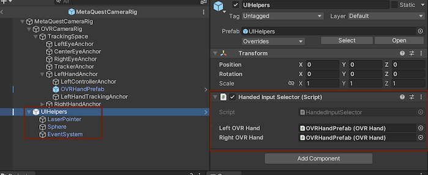
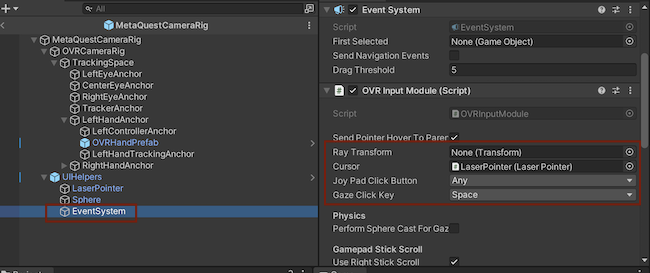
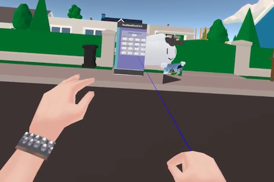
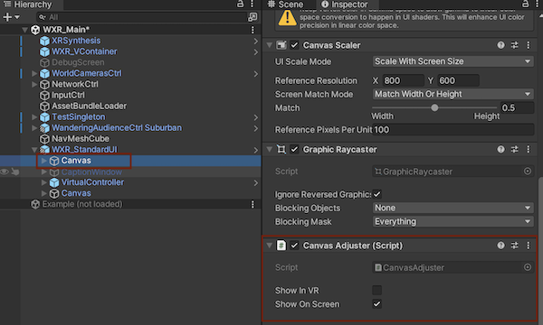
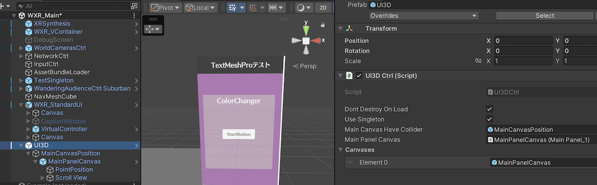

> Author: TriHD
> 
> Last updated: 28-05-2024
> 
> [Vietnamese]
# UI Interaction For Quest

## Related Platforms
Platform   |Notes       
----------------|------------
[Common](../Input.md)|Input for all platforms.
[Vive](./UI_Interaction_Vive.md)|UI interaction for Vive.

## Flow
### Diagram


### Description
1. XRSynthesisLifetimeScope (VContainer)
````
- Đăng ký ICameraRig, ICameraRig được kế thừa bởi MetaQuestCameraRig.
- Đăng ký ICanvasRaycasterProvider, ICanvasRaycasterProvider được kế thừa bởi MetaQuestCanvasRaycasterProvider.
- Nhiệm vụ của MetaQuestCanvasRaycasterProvider là cung cấp raycast component cho UI để có thể tương tác.
````

2. HandedInputSelector (Domain - UI Interaction)
````
- Kiểm tra xem đang dùng controller mode hay hand tracking mode.
- Tìm pointer pose từ OVRHand.
- Tùy thuộc vào mode tìm được ở trên mà OVRInputModule sẽ nhận ray transform như sau:
  + Hand tracking mode: nhận left/rightHandTrackingAnchor từ OVRCameraRig là ray transform.
  + Controller mode: nhận left/rightHandAnchor từ OVRCameraRig là ray transform.
- Ray transform ở trên sẽ dùng để nhận hit target (khi hit UI) và vẽ line renderer.
````


3. OVRInputModule (Domain - UI Interaction)
````
- Detect phần UI interaction bằng EventSystem và raycast.
- Nhận ray transform để xử lý direction của ray pointer.
- Nhận LaserPointer (kế thừa OVRCursor) để detect hit target và vẽ ray bằng line renderer.  
````



4. OVRCameraRig (Domain - UI Interaction)
````
- Khởi tạo và cập nhật phần tracking từ Quest device cho:
  + Left/Right/Center eye anchor.
  + Left/Right hand anchor (controller anchor và hand tracking anchor).
- Phần cập nhật tracking dùng để làm input xử lý cho HandedInputSelector ở trên.
````

5. LaserPointer (Domain - UI Interaction)
````
- Nhận thông tin về hit target từ OVRInputModule.
- Xử lý phần hiển thị ray pointer (laser màu xanh dương) bằng line renderer.
````

6. OVRHand (Domain - UI Interaction)
````
- Lấy thông tin về pointer pose (active/inactive) và transform của nó.
- Dùng thông tin tìm được để xử lý direction và start position cho ray pointer ở OVRInputModule.
````

7. CanvasAdjuster (Domain - UI Interaction)
````
- Kiểm soát việc hiện UI panel ở chế độ VR mode và UI mode.
- Cung cấp raycast component thích hợp cho platform hiện tại (Xem thêm MetaQuestCanvasRaycasterProvider).
- Sử dụng CanvasAdjuster để setup tương tác một cách tự động.
- Nếu muốn tương tác thủ công bằng script thì tham khảo phần <b>Important Notes</b> bên dưới.
````


8. OVRRaycaster (Domain - UI Interaction)
````
- Là component dùng để đính lên trên những UI cần tương tác với ray pointer của Quest.
- Khi attach CanvasAdjuster trên những UI cần tương tác thì OVRRaycaster sẽ auto được attach cùng.
````

## Important Notes
1. <ins>How to scroll UI panel
- Chiếu laser point vào phần UI panel cần scroll.
- Pinch ngón thumb và index và <b>giữ pinch trong vài giây</b>.
- Vẫn giữ pinch và di chuyển bàn tay về bên trái hoặc phải để scroll.
- Để biết cách đổi thao tác cho phần scroll, cần đọc thêm ở đây:
  - https://developer.oculus.com/blog/unitys-ui-system-in-vr/
  - https://developer.oculus.com/documentation/unity/unity-ovrinput/
  - Tham khảo thêm ở đây cho phần <b>Quest</b>: [My_Notes/Platform](../../../My_Notes/Platform.md)
  
2. <ins>Interact With UI Manually
- Đối với những 3D UI mà không dùng CanvasAdjuster đính kèm:
  - Inject ICanvasRaycasterProvider vào script cần tương tác với UI.
  - Chọn ra những UI canvas cần tương tác và add vào ICanvasRaycasterProvider.
  - Xem script UI3DCtrl để tham khảo.

