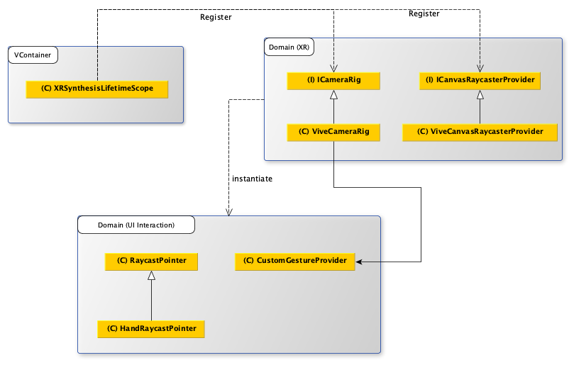
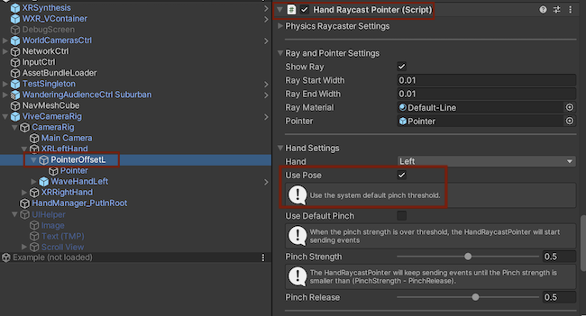
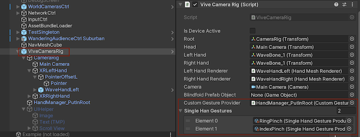

> Author: TriHD
> 
> Last updated: 28-05-2024
> 
> [Vietnamese]
# UI Interaction For Vive

## Related Platforms
Platform   |Notes       
----------------|------------
[Common](../Input.md)|Input for all platforms
[Quest](./UI_Interaction_Quest.md)|UI interaction for Quest.

## Flow
### Diagram


### Description
1. XRSynthesisLifetimeScope (VContainer)
````
- Đăng ký ICameraRig, ICameraRig được kế thừa bởi ViveCameraRig.
- Đăng ký ICanvasRaycasterProvider, ICanvasRaycasterProvider được kế thừa bởi ViveCanvasRaycasterProvider.
- Hiện tại ViveCanvasRaycasterProvider chưa có phần xử lý nào liên quan tới UI.
````

2. HandRaycastPointer (Domain - UI Interaction)
````
- Xử lý phần raycast tới UI và vẽ bằng line renderer.
- Nếu enable "Use Pose" sẽ dùng default pose để apply position/rotation cho ray pointer.
````


3. CustomGestureProvider (Domain - UI Interaction)
````
- Setup những custom gesture được tạo ra.
- Tính năng hiện tại yêu cầu:
  - Thêm custom gesture là pinch ngón ring tay trái để di chuyển nhân vật.
  - Thêm custom gesture là pinch ngón ring tay phải để xoay nhân vật.
````

