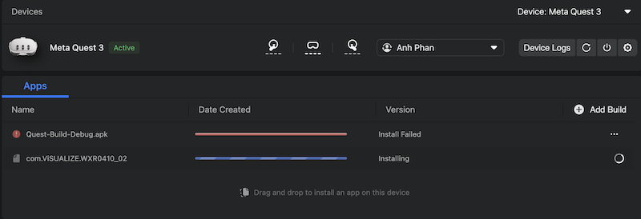
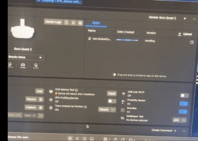
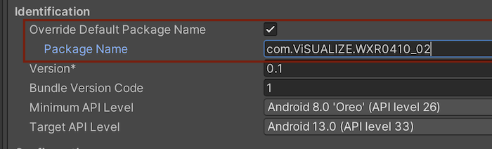
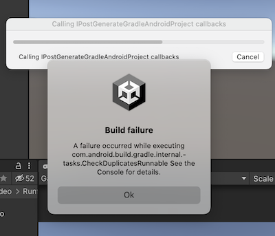
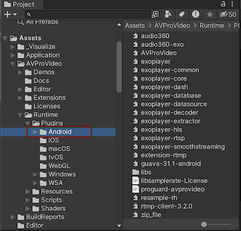

> Author: TriHD
> 
> Last updated: 29-05-2024
> 
> [Vietnamese]
# Platform Build
## Quest
1. <ins><b>Lỗi không cài được apk vào Hub</b></ins>
- Sau khi build app và cài apk thông qua Meta Quest Developer Hub. Đôi khi sẽ gặp lỗi cài đặt như sau:
  - Lỗi 1: Quá trình cài đặt không bao giờ kết thúc và xuất hiện line đỏ.
   
  - Lỗi 2: Quá trình cài đặt bị kết thúc giữa chừng.
    
  

- Cách xử lý:
  - Đổi package name thành một tên khác và thử lại.
  

## Mobile
1. <ins><b>Lỗi không build được file apk</b></ins>
- Đôi khi sẽ gặp tình trạng lỗi như sau:
  
   

- Cách xử lý:
  - Xóa toàn bộ folder chứa plugin Android của AVProVideo như hình:
  
  - Khi hoàn tất task và switch sang một branch khác thì nhớ reset lại tránh xóa luôn.
 
