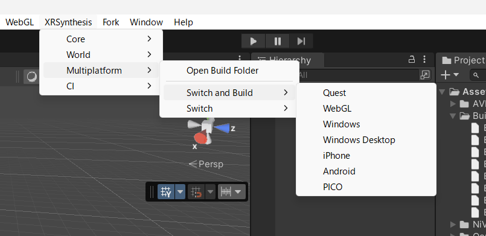
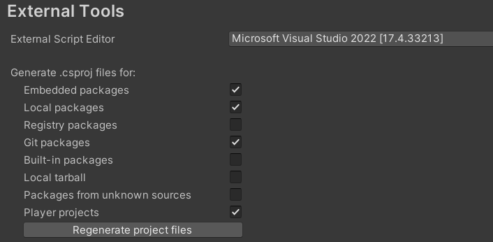
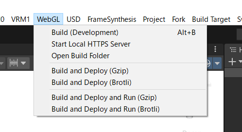
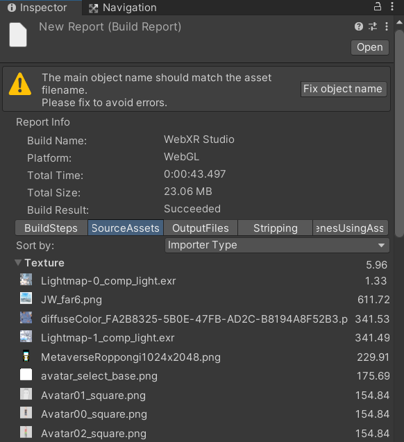
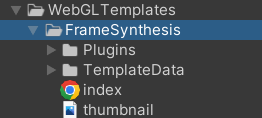

# Project file overview

## Build method

First, switch the platform using the XRSynthesis > Multiplatform menu and build and run (as of July 2023, WebGL and Quest are being developed relatively preferentially and are stable in operation).



The XRSynthesis.Multiplatform function is intended to collectively change settings for Unity build targets, packages, camera rigs, XR Plugin Management plugins, etc. Be sure to switch the platform from this menu, not from Unity's Build Settings.

## IDE settings

Visual Studio 2022 or Rider can be used. Since we are using packages, during development please check the following in Preferences > External Tools and press the "Regenerate project files" button.



## Efficient multiplayer development

A batch file called CreateMirrorProject.bat is provided in the project root.

````
CreateMirrorProject.bat ..\XRSynthesis-Mirror1
CreateMirrorProject.bat ..\XRSynthesis-Mirror2
````
You can create a mirror project like this (the Assets, LocalPackages, Packages, and ProjectSettings folders are mirrored at the junction). You can test multiplayer by opening multiple units of Unity and opening and playing each project.

Please note that ParrelSync and Unity's official Multiplayer Play Mode cannot mirror folders other than standard folders (in this case, the LocalPackages folder), which causes some inconvenience.

## Build and deploy WebGL

***Looks like we need to do something about this**

I'm creating a WebGL menu to make building and deploying easier. We are using [WebGLBuildAndDeploy](https://github.com/korinVR/WebGLBuildAndDeploy), which is published as OSS.



Executing Build (Development) will perform a local Development build. Run Start Local HTTPS Server to open a locally built page (it uses [Browsersync](https://browsersync.io/), so it must be installed). Open your local build folder with Open Build Folder.

When you run Build and Deploy, each build is built with Gzip/Brotli compression and deployed with a timestamp to the deployment destination set in WebGLDeploySettings (AWS CLI installation and authentication settings are required). Although Brotli compression is smaller in size (about 3/4 of Gzip), it takes a lot of time to compress, so it is recommended to build with Gzip compression when checking operation.

When you build with the WebGL menu, the wasm and data file sizes are output to the console.

## To reduce build size

Unity's WebGL build mainly outputs wasm files (executable binaries) and data files (assets).

When running on a smartphone, I think a total of about 20MB is realistic considering the download time on a 4G line and CDN network transfer fees (although some people have published WebGL builds with tens of MB or even 100MB). , everyone leaves during a long download, and with AWS it costs about 17 yen to distribute 1 GB. Also, if you are traveling by train, you may have to wait several tens of seconds even for 10 MB). So, it comes down to what to include within that range.

We have taken various measures to reduce the build size. I have made notes on the basic points on the following page.

- [Unity WebGL Build Memo \- Frame Synthesis](https://framesynthesis.jp/tech/unity/webgl/)
- [How to reduce Unity build size \- Frame synthesis](https://framesynthesis.jp/tech/unity/buildsize/)

Once built, you can view the build report by selecting Window > Open Last Build Report (a feature of the Build Report Inspector package). Now let's see if any unnecessary assets are included. Adjust the import settings if the texture or FBX size is large.



### World Optimization

Burning a lightmap greatly improves the visual quality, so it seems better to consider spending a few MB on a lightmap as a necessary cost. In order to halve the lightmap capacity, the Directional Mode is changed to Non-Directional.

- [Memo on how to bake Unity lightmaps \- Frame Synthesis](https://framesynthesis.jp/tech/unity/lighting/)

Also, if you set Mesh Compression to Medium in the model import settings, the capacity will be approximately halved (the accuracy of the vertex coordinates will decrease.High will obviously disrupt the appearance, so it seems unusable).

### Font optimization

~~Including Japanese fonts in the build increases the size by several MB, so I use a font file (OprimizedFont.ttf) that includes only the necessary characters (glyphs) from the original font file. ~~

There is an original font file and a batch file for optimization (CreateOptimizedFont.bat) in the ~~Assets/WebXRStudio/Fonts/OriginalFont~ folder, and I used pyftsubset to create a subset font containing only the characters contained in Messages.txt. is being generated. pyftsubset can be installed in Python 3 with pip install fonttools. ~~

This is currently not in use. This is because when using Dynamic fonts on iOS 16, there is a phenomenon where the text freezes for about 5 seconds when displaying the string for the first time.

### Package optimization

I try not to use TextMesh Pro, UI Toolkit, and Input System because the size increases by several MB when used. I also disabled various built-in packages in Package Manager.

[VContainer](https://github.com/hadashiA/VContainer), [UniTask](https://github.com/Cysharp/UniTask), [UniRx](https://github.com/neuecc/UniRx) , [MessagePipe](https://github.com/Cysharp/MessagePipe) was used because it only increases about a few dozen KB each. Since DOTween has a somewhat large capacity as a tween library, we use [AnimeTask](https://github.com/kyubuns/AnimeTask).

### About the output web page

Templates for each project are added to the WebGLTemplates folder (the Project menu changes which one to use).



Unity default template

- Display in full browser screen
- Display logo
- Added JavaScript plugin

We are making changes such as:

### About WebXR support

We are using [WebXR Export](https://github.com/De-Panther/unity-webxr-export) created by De-Panther.

- [Unity \+ WebXR Development Memo \- Frame Synthesis](https://framesynthesis.jp/tech/unity/webxr/)

It also works on Quest's browser, but the frame rate is poor. It seems to be CPU bound, because Quest's CPU is slow, it is running in the browser, and WebXR Export does not optimize stereo rendering at all (it simply renders the left and right screens twice). . My impression is that we are waiting for Unity to officially support WebXR in the future, or for the next generation of Quest to come out.

### About Mesh Animator

The SkinnedMeshRenderer used for avatar characters has a large CPU load (Unity's WebGL build cannot be skinned on the GPU). I'm trying to use an asset called Mesh Animator to display a lot of mob characters. The amount of animation data is fairly large, and is proportional to the number of polygons and the total number of frames of the animation.

- [Mesh Animator official documentation](http://www.jacobschieck.com/projects/meshanimator/documentation/documentation.html)

The basic method for baking NPC_F and NPC_M is as follows (playback may not work properly if Project Settings > Editor > Editor Play ModeOptions is turned on).

- Open MeshAnimatorWorkspace scene
- Open Asset > Create > Mesh Animator...
- Set NPC_F and NPC_M of the scene to Asset to Bake
- Specify Assets/MeshAnimatorWorkspace/Generated/NPC_F/NPC_M for Output Folder
- Configure the following settings
     - Bake FPS: 5 (lower frame rate to save space)
     - Position Compression: Meduim Quality (lower vertex coordinate accuracy to reduce capacity)
     - Mesh Normal Mode: UseOriginal (reduces capacity by not including normal data)
     - Read/Write must be turned on in the model import settings